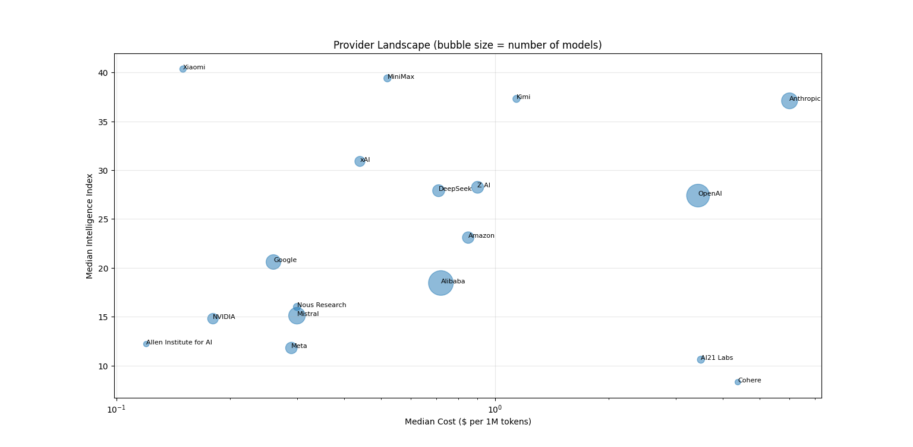

# How to Choose an LLM in 2026: A Data-Driven Value Analysis

**Dataset:** LLM Price-Performance Tracker (Kaggle, March 2026) — 453 models, 47 providers, benchmarked on intelligence, cost, and speed via Artificial Analysis and Arena AI.

**Method:** 313 models with complete cost + intelligence data were analyzed across six dimensions: value frontier, speed-cost relationship, open-source vs. proprietary, model depreciation, use-case fit, and provider landscape.

---

## 1. The Value Frontier — Where Your Money Actually Buys Intelligence

Only **16 of 313 models (5%)** are genuinely "Pareto-optimal" — meaning no cheaper model matches their intelligence score. Everything else is, mathematically, a worse deal than something already on the market.

**Key takeaways:**
- Free and near-free open-source models (Gemma, Qwen2.5, Apriel) already deliver intelligence scores up to ~28 at **$0.00/1M tokens** — paying anything below $0.10/1M buys nothing extra.
- The frontier tops out at **Gemini 3.1 Pro Preview** ($4.50/1M, intelligence 57.2) — the smartest model where you still can't find equal intelligence cheaper.
- **14 of the 16 frontier models are open-source** — but see Section 3 for why this doesn't mean "open-source wins" overall.

---

## 2. Speed vs. Cost — You're Not Paying for Speed

Correlation between cost and output speed: **r = -0.20** — weakly *negative*.

**What this means:** More expensive models do not run faster. If anything, they trend slightly slower. The fastest model in the dataset, **Mercury 2** (905.75 tokens/sec), costs just $0.375/1M — while the priciest models (**GPT-4, o3-pro, Claude Opus** at $26–37/1M) sit in the 27–40 tokens/sec range. Premium pricing buys reasoning depth and capability, not throughput.

---

## 3. Open-Source vs. Proprietary — A Nuanced Verdict

| | Open Source (197 models) | Proprietary (116 models) |
|---|---|---|
| Median cost | $0.40/1M | $3.44/1M |
| Median intelligence | 16.5 | 31.25 |
| Best model's intelligence | 49.8 | 57.2 |

Open-source is **~9x cheaper on median cost**, but proprietary models are **nearly 2x smarter on a typical (median) basis**. The Section 1 finding that "open-source dominates the frontier" only holds for the *best* open-source models — the *average* open-source model is a small, weak variant that drags the median down hard.

**Verdict:** Open-source is only truly competitive at the top end. The best open-source model (GLM-5, 49.8 intelligence) trails the best proprietary model by just 13%, at roughly a quarter of the price. Cherry-picking matters — "open-source" as a category is not a shortcut to quality.

---

## 4. The Legacy Tax — Models You Should Stop Paying For

97% of models (305 of 313) are "dominated" (beaten on both cost and intelligence by something else) — expected, given the frontier is small. What's useful is *who* dominates worst:

| Model | Cost ($/1M) | Intelligence |
|---|---|---|
| o1-pro | $262.50 | 25.8 |
| GPT-4 | $37.50 | 12.8 |
| o3-pro | $35.00 | 40.7 |
| Claude 3/4 Opus (various) | $30.00 | 18–42 |
| o1 / o1-preview | $26.25 | 23.7–30.8 |
| GPT-4 Turbo | $15.00 | 13.7 |

**Takeaway:** This isn't a story about "bad models" — it's **model depreciation**. Legacy flagships (GPT-4, o1-family, Claude 3/4 Opus) are now strictly worse deals than their own successors. Anthropic's older Opus tiers depreciate especially fast — 8 of the 15 worst-dominated models are Claude Opus variants. **If you're still running GPT-4 or Claude 3 Opus in production, migrating is free performance and cost savings, not just a nice-to-have.**

---

## 5. Best Model by Use Case — There Is No "Best Model"

| Use Case | Winner | Cost ($/1M) |
|---|---|---|
| Coding | GPT-5.4 (xhigh) | $5.63 |
| Math | GPT-5.2 (xhigh) | $4.81 |
| Knowledge / Document QA | Gemini 3 Pro Preview (high) | $4.50 |
| Hard Reasoning | Gemini 3.1 Pro Preview | $4.50 |
| General Chatbot (human preference) | Claude Opus 4.6 (High Effort) | $10.00 |

No provider wins every category. **Gemini 3.1 Pro Preview** is the strongest generalist, landing in the top rankings for coding, hard reasoning, and chatbot preference — the best single pick if you can only choose one model.

**Budget callout:** For math specifically, **MiMo-V2-Flash** (open-source, Xiaomi, $0.15/1M) scores 96.3 versus GPT-5.2's 99.0 at $4.81/1M — a 97% cost saving for a 3-point score gap.

---

## 6. Provider Landscape — Volume ≠ Quality

Ranked by **median** intelligence across each provider's full lineup (providers with 3+ models):

| Provider | # Models | Median Cost | Median Intelligence | Best Model |
|---|---|---|---|---|
| Anthropic | 25 | $6.00 | 37.1 | 53.0 |
| Xiaomi | 4 | $0.15 | 40.35 | 49.2 |
| MiniMax | 5 | $0.52 | 39.4 | 49.6 |
| Kimi | 5 | $1.14 | 37.3 | 46.8 |
| OpenAI | 51 | $3.44 | 27.4 | 57.2 |
| Google | 21 | $0.26 | 20.6 | 57.2 |
| Alibaba | 60 | $0.72 | 18.45 | 45.0 |

The household names don't top median quality. **OpenAI and Google both hit the highest single-model intelligence score (57.2)** but rank mid-to-low on the median — they ship wide portfolios spanning nano/flash variants to frontier flagships, which drags the median down. **Alibaba has the most models by far (60)** but middling median quality — more evidence that model count doesn't indicate typical quality. **Anthropic has the tightest, most consistently strong lineup** — 25 models with a median close to its ceiling.

---

## Bottom Line

1. Don't overpay below the frontier — free/cheap models already cover a wide intelligence range.
2. Cost buys intelligence, not speed.
3. "Open-source" isn't a shortcut to quality — pick specific models, not categories.
4. Audit your stack for legacy flagships — they're a silent cost-and-performance tax.
5. Match the model to the task; no single model wins everything.
6. Judge providers by typical output, not their best headline model.

*Analysis based on LLM Price-Performance Tracker (Kaggle, March 2026 snapshot). Benchmarks and pricing reflect a single point in time in a fast-moving market — re-run this analysis periodically as new models ship.*
